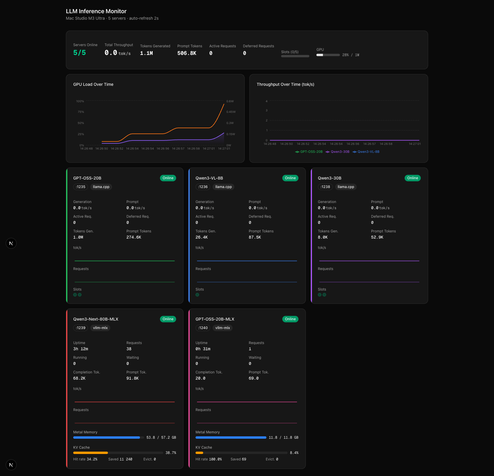

# vllm-mlx Dashboard

Real-time monitoring dashboard for local LLM inference servers running on Apple Silicon. Tracks [llama.cpp](https://github.com/ggml-org/llama.cpp), [vllm-mlx](https://github.com/vllm-project/vllm-mlx), [oMLX](https://github.com/jundot/omlx) and [Splash](https://github.com/incoai/splash) (DFlash2) backends from a single UI.



## Features

- **Global stats** — aggregated online count, throughput, token totals, active/deferred requests, slot utilization, GPU usage
- **Per-server cards** with live metrics:
  - **llama.cpp** — generation & prompt tok/s, active/deferred requests, slot status
  - **vllm-mlx** — uptime, running/waiting requests, completion & prompt tokens, Metal GPU memory (active/peak), KV-cache hit rate & utilization
  - **oMLX** — every loaded model with its individual requests (queued with position, prefill progress/speed/ETA, generating tok/s), model memory against soft/hard limits, per-model prefix cache (blocks, SSD, hot), session and all-time totals, installed-but-unloaded models
  - **Splash** — request pipeline by stage (preparing → queued → waiting for memory/prefix → encoding → decoding), running batches, encoding and decoding tok/s both as throughput (per wall-clock second) and kernel speed (per GPU-busy second), TTFT and inter-token p50/p95, DFlash2 draft acceptance and decode batch widths, memory budget, prefix cache, failures
- **System card** — unified memory (wired, compressed, file cache), swap, load, GPU, and the engine processes (CPU, RSS)
- **Sparkline charts** per server — tok/s throughput and active requests history
- **Throughput chart** — real-time tok/s computed from token count deltas (not averaged gauges)
- **GPU chart** — utilization % and power draw over time
- Auto-refresh via SWR polling (2s servers, 5s GPU)

## Monitored Servers

| Server | Port | Framework |
|--------|------|-----------|
| Splash · Qwen3.6-35B-A3B (UD-Q4_K_XL) | 8001 | splash (needs `SPLASH_API_KEY` in `.env.local`) |
| oMLX (35B fallback, Flash-Next, …) | 8000 | omlx |

Server list is configured in `src/lib/server-config.ts`.

## Tech Stack

- **Next.js 16** (App Router)
- **React 19** + **TypeScript**
- **Tailwind CSS 4** + **shadcn/ui**
- **Recharts** for time-series charts
- **SWR** for data fetching

## Getting Started

```bash
npm install
npm run dev
```

Dashboard runs at [http://localhost:3000](http://localhost:3000).

## API Endpoints

| Endpoint | Description |
|----------|-------------|
| `GET /api/servers` | Aggregated status from all configured servers |
| `GET /api/gpu` | GPU utilization and power metrics |

## How It Works

The Next.js API routes poll each inference server on every request:

- **llama.cpp** servers: fetches `/health`, `/metrics` (Prometheus), and `/slots`
- **vllm-mlx** servers: fetches `/health` and `/v1/status` via `Promise.allSettled` — gracefully degrades if `/v1/status` is unavailable
- **oMLX**: `/admin/api/activity`, `/admin/api/stats?scope=session|alltime`, `/admin/api/models`. ⚠️ `stats` returns the server's API key in plain text — only named fields are copied, never the whole object.
- **Splash**: `/health` (public) and `/status` (bearer token from `SPLASH_API_KEY`, server-side only)

The chat tab is rate-limited per client (`src/app/api/chat/route.ts`) because the dashboard is public and the models are production ones.

Production runs `next start` under pm2 (`ecosystem.config.cjs`): `npm run build && pm2 restart monitoring`.

The frontend uses SWR to poll `/api/servers` every 2 seconds and computes real-time throughput from the delta of cumulative token counters between consecutive polls.
